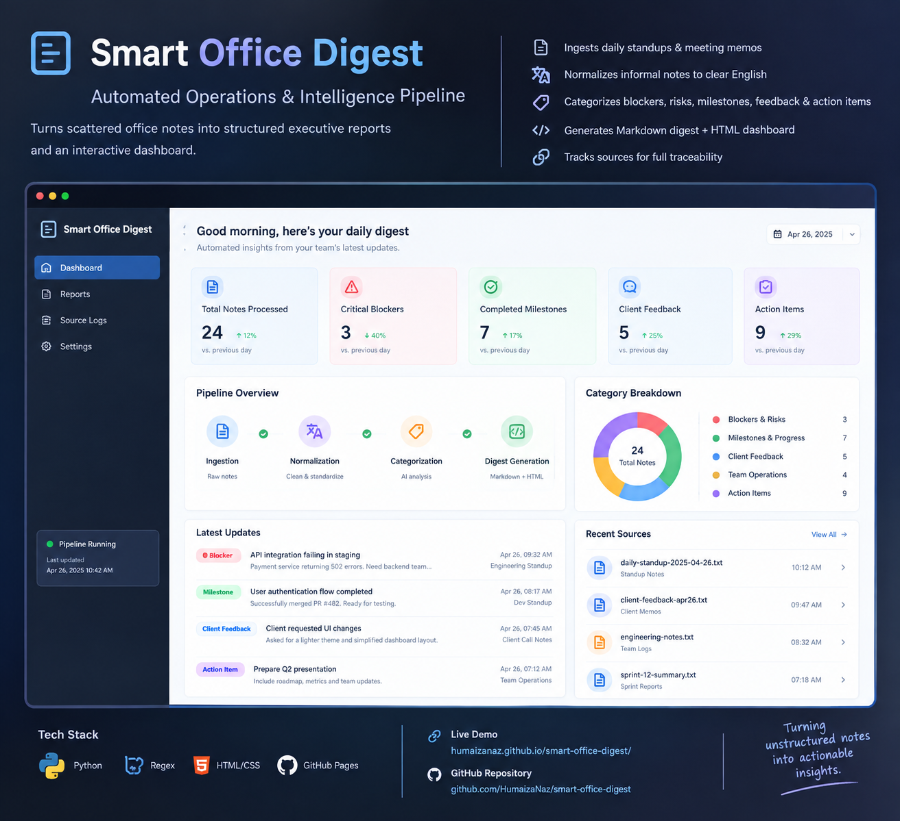

# 🏢 Smart Office Digest — Autonomous Operations & Intelligence Pipeline

[](https://www.python.org/)
[]()
[](https://opensource.org/licenses/MIT)
[](https://humaizanaz.github.io/smart-office-digest/)

> **Turns scattered office notes into structured executive reports and an interactive dashboard.**



---

## 📌 Problem Statement
In fast-paced engineering and product teams, critical updates are often scattered across disparate channels (daily standups, client chats, bug trackers, and meeting notes). Executives and project leads spend hours manually consolidating this information to assess risks, track deliverables, and align cross-functional teams.

## 💡 Solution
**Smart Office Digest** provides a lightweight, automated pipeline that:
1. 📄 **Ingests** unstructured daily standup notes, memos, and logs from local/shared sources.
2. 🔤 **Normalizes & Translates** informal team notes (including multi-lingual Roman Urdu/Hindi) into standardized, corporate-grade English.
3. 🏷️ **Categorizes** logs into critical business pillars:
   - ⚠️ **Blockers & High-Priority Risks**
   - 🚀 **Milestones & Progress Highlights**
   - 💬 **Client Requirements & Feedback**
   - 👥 **Team Operations & Standup Notes**
   - 📋 **Action Items & Accountability Checklists**
4. 💻 **Generates** clean Executive Markdown digests and modern, responsive **HTML Dashboards**.
5. 🔗 **Tracks Sources** for full auditability and traceability.

---

## 🏗️ Architecture & Workflow

```
┌───────────────────────────────┐
│     Raw Office Inputs         │
│  (Daily Notes, Memos, Text)   │
└──────────────┬────────────────┘
               │
               ▼
┌───────────────────────────────┐
│   Digest Engine & Parser      │
│  - Ingestion & Normalization  │
│  - Multi-Lingual Translation  │
│  - Heuristic Classification   │
└──────────────┬────────────────┘
               │
       ┌───────┴───────┐
       ▼               ▼
┌──────────────┐┌──────────────┐
│  Executive   ││ Modern Web   │
│ Markdown Doc ││ HTML UI      │
└──────────────┘└──────────────┘
```

---

## 🚀 Key Features
- **Zero Configuration Run:** Automatically detects new notes added to the source folder.
- **Dynamic Translation & Normalization:** Intelligently maps informal team shorthand into executive English.
- **Risk Mitigation Matrix:** Formats blockers with dates, root cause descriptions, and source traceability.
- **Interactive Action Checklist:** Generates browser-ready checkboxes for team accountability.
- **Multi-Format Distribution:** Produces standalone `.md` reports for Slack/Notion and `.html` dashboards for web viewing.

---

## 🛠️ Tech Stack
- **Language:** Python 3
- **Core Modules:** `re`, `os`, `glob`, `datetime`, `json`
- **Frontend / UI:** Modern CSS3 (CSS Variables, Flexbox, CSS Grid) & HTML5
- **Export Formats:** Markdown (`.md`), Interactive Web Dashboard (`.html`)
- **Hosting / Deployment:** GitHub Pages

---

## ⚡ Quick Start

### 1. Clone the repository
```bash
git clone https://github.com/HumaizaNaz/smart-office-digest.git
cd smart-office-digest
```

### 2. Add your daily notes
Drop your `.txt` or `.md` notes into `Office_Digest_Source/`:
```text
Date: 22 Sept
- Payment gateway documentation received, integration unblocked
- Client approved revised blue color palette
- Action: Deploy staging build on Monday
```

### 3. Generate the Digest
```bash
python generate_digest.py
```

### 4. View Results
- **Live Web Dashboard:** [humaizanaz.github.io/smart-office-digest/](https://humaizanaz.github.io/smart-office-digest/)
- **Markdown Digest:** [`Office_Digest_Output/Weekly_Digest_Latest.md`](Office_Digest_Output/Weekly_Digest_Latest.md)
- **HTML Dashboard:** Open [`index.html`](index.html) in any browser.

---

## 📄 License
This project is open-source and available under the [MIT License](LICENSE).
